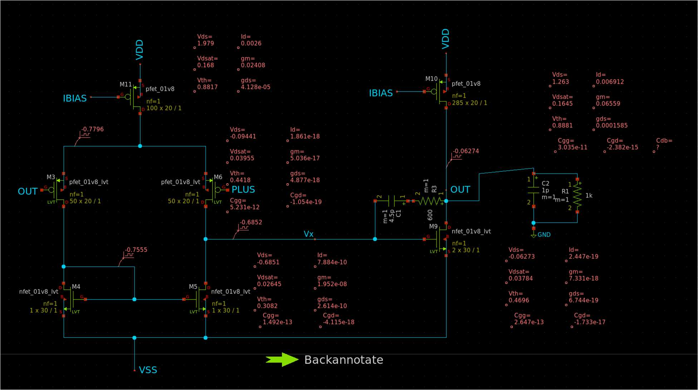

# Miller Amplifier 

The Miller Amplifier is a popular electronic amplifier configuration. It's known for its feedback between the input and output, which results in a unique frequency response.

## Simulation Results

This repository contains several simulation results showcasing the performance and characteristics of the Miller Amplifier:

### AC Simulation

### DC Sweep

### Miller Schematic

### Transient Analysis with 10ms Ramp

